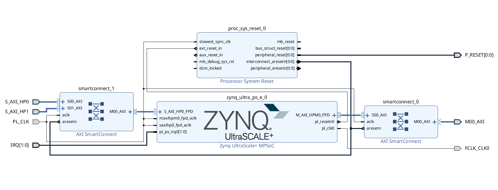
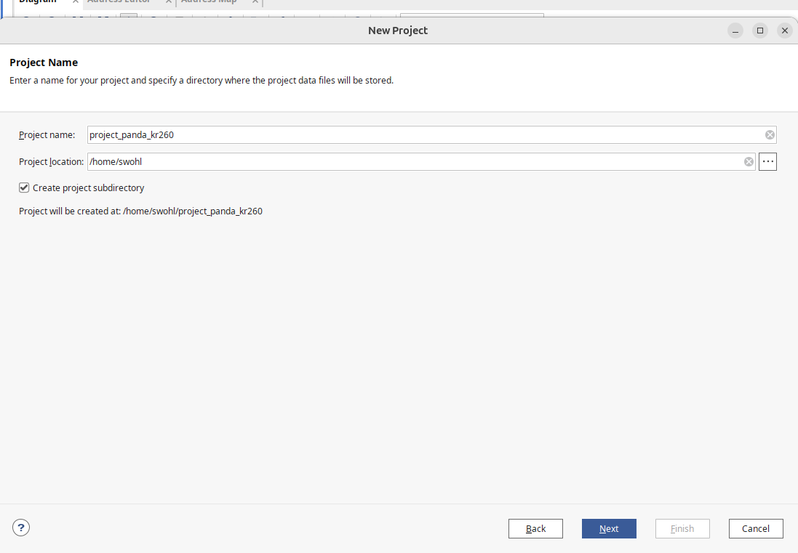
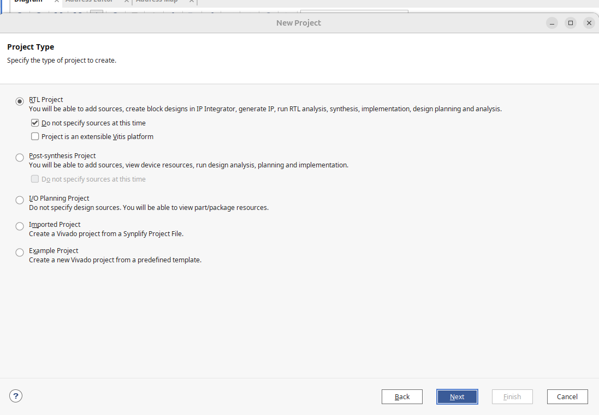
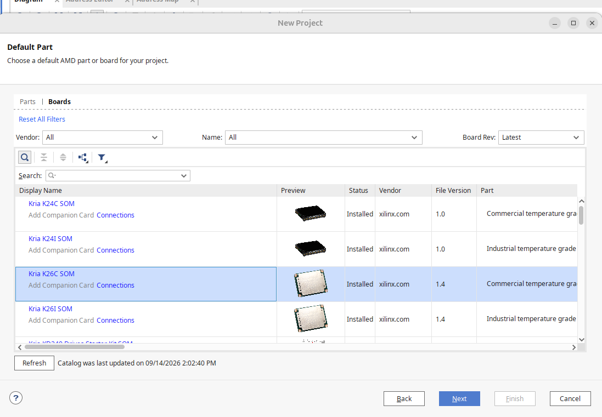
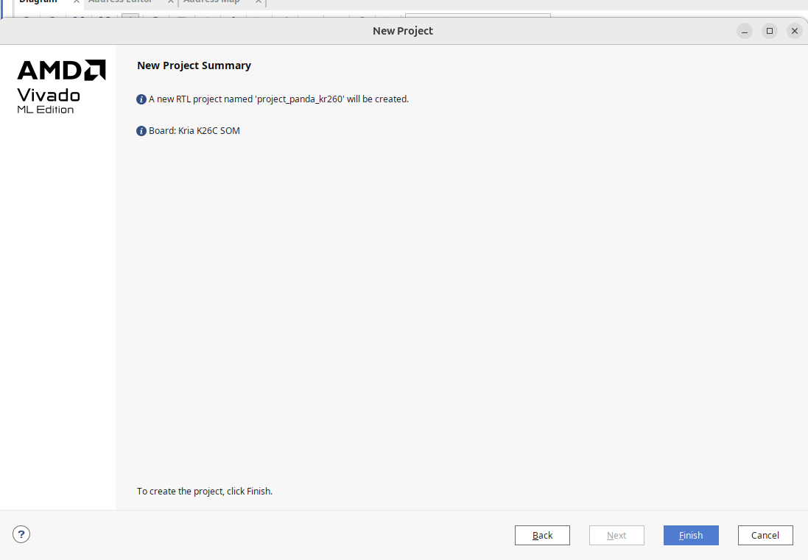
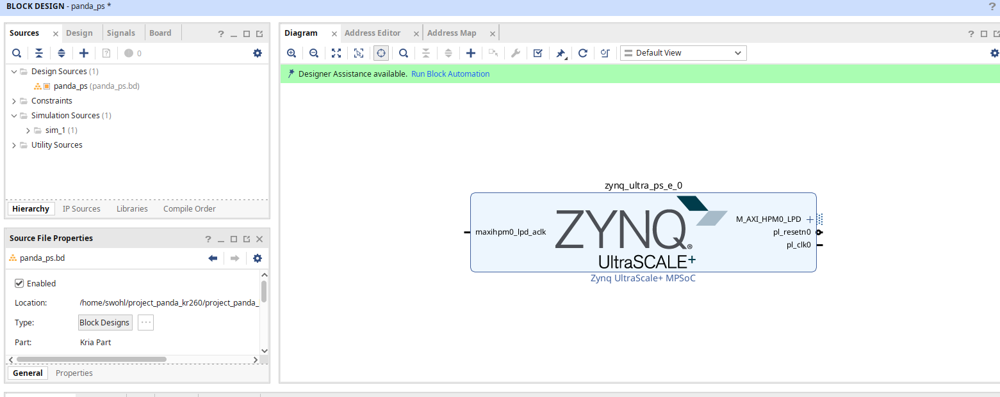
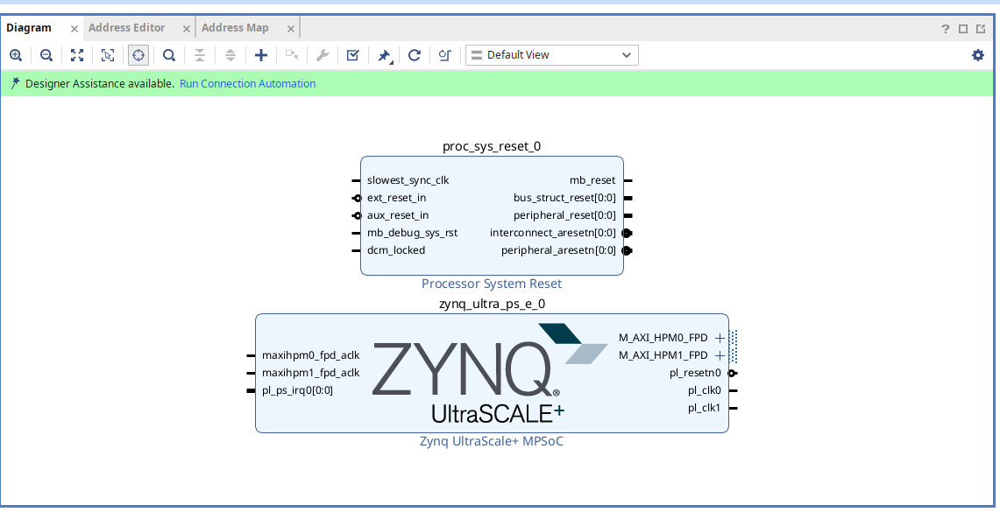
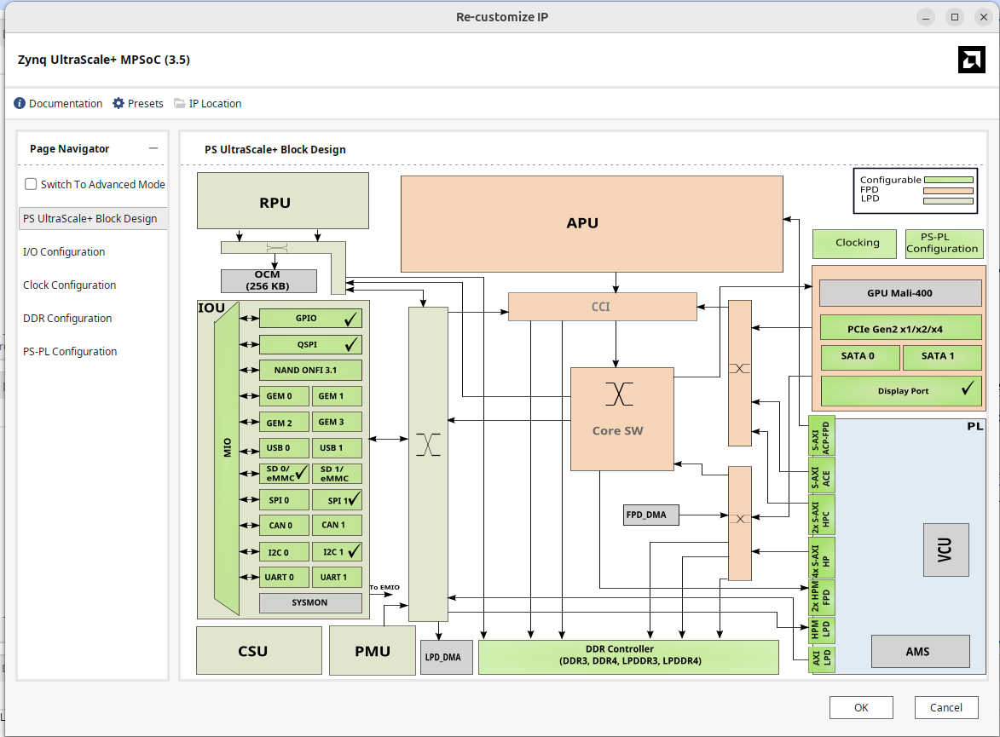
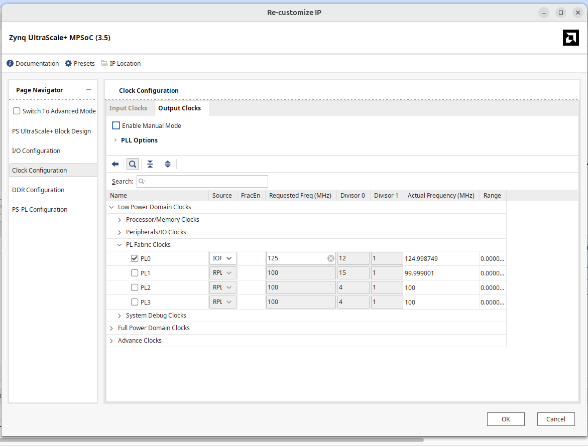
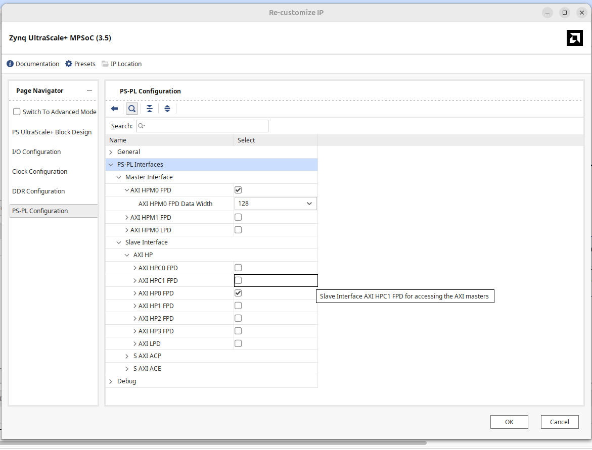

# Guide
This document will serve as a guide for integrating the KR260 platform into the pandablocks-fpga and meta-panda project.  The goal of this project is to try and get a functional system running with the control of the FPGA via the pandablocks web service.


## Prereqesuties
KR260 Dev Board
Vivado toolchain for 2024.2 (not the 2023.2 used by pandablocks)

## Design

```bash
git clone https://github.com/PandABlocks/PandABlocks-FPGA
cd PandABlocks-FPGA
```

We need to create a new target for the project.  When doing this we will not use the development board as the target of vivado, but instead the raw part number `XCK26-SFVC784-2LV-C` because that is much closer to the eventual target platform ofr the board being developed in Alba.  In addition `board_connection` will be done via the xdc file instead of any of the automation supplied by the vivado board part.  This should make adapting the board simpler in future generations.

The first goal of the project is to get a functioning PMOD input and PMOD output working through the PandABlocks `di` and `do` modules.  For ease of se we will include the led `UF1` to mirror the output of the `do` pandablock.

### Where we put things
- PL package pins and the timing are in the `const/` folder.
- DDR, MIO boot, clocks, axi and interrupts belong in a board file.  This will be located in the `bd/panda_ps.tcl` file.

The panda_ps.tcl file contains configuration that was generated and validated by Vivado 2024.2.  The file was exported and its configuration brought into the panda_pc.tcl for the `CONFIG.PSU_*` to facilitate the creation of the new platform.

### Faster validation loop
To create a small smoke test that can be used before needing to move onto a full build system and used to verify the axi system and pmod output is function we will create a small vitis application that can program the kr260.  That file will be located in `targets/kr260/baremetal/create_vitis.py`

The program will create a workspace under `build/targets/kr260/vitis`.  The program will run on the A53-0 domain, use UART for communication, generate a FSBL and the `kr260_hello.elf`.  This program will verify that the axi interfaces and interrupts work.  This gives us confidence that the PCAP system will work and that the server driven work on the PS should be in working order.

The complicated part that will continue to bite during this is seen here also.  The KR260 plaform has some differences between other FPGAs in the Xilinx lineup and the jtag flow exposes one of them.  In order to have a functioning axi interface over the jtag flow we need to control the boot sequence for this platform.  Some tcl scripting has been done to make this easier, but it does add a level of complication to the project flow.


### Step 0
We need to create a vivado project for the ps block design of the kr260.

### Step 1
```bash
touch apps/kr260-no-fmc.app.ini
touch targets/kr260/kr260.target.ini
```
The basic app we are creating is defined below.  This will be the application that describes the blocks we wish to use and will package the bitstream needed to program it for the pandabox we are creating.

`apps/kr260-no-fmc.app.ini`

```filename="apps/kr260-no-fmc.app.ini"
[.]
description:
    Initial KR260 bring-up image with PMOD digital I/O and no FMC module
target: kr260
includes: common_soft_blocks.include.ini
```

This is the target platforms blocks that we will add for the KR260.

`targets/kr260/kr260.target.ini`
```filename="targets/kr260/kr260.target.ini"
[.]

[PCAP]
number: 1

[SYSTEM]
module: system_zynqmp
number: 1

[PMOD_IN]
module: di
block: no_term_di
ini: no_term_di.block.ini
number 4

[PMOD_OUT]
module: do
number: 4
```

#### Caveat #1
The PMOD_IN took some special consideration.  There was existing work in for the `block: no_term_di` which would disable the termination selection for the digital inputs.  The existing `no_term_di.block.ini` may have an error in it.  The entity and the extension are declared as di.  This results in not picking up the no_term_di fully and instead using the default.  This can be overcome by explicitly setting the ini for the block so that the extension generator of pandablocks does not fall back to the di.block.ini.


#### Caveat #2
We have no io field in our target unlike other platforms.  The io field is found underneath `[.]` in other targets and is used to define things like the SFP or FMC.  Currently we do not have any io field defined and this causes an error in the `common/python/generate_app.py`.

To fix this I changed the code
```diff
- for target in target_info:
+ for target in filter(None, (item.strip() for item in target_info)):
```

The includes bring in the generic set of blocks for the PandaBox platform located in `includes/common_soft_blocks.include.ini`.

```ini
[BITS]
number: 1

[CALC]
number: 2

[CLOCK]
number: 2

[COUNTER]
number: 8

[DIV]
number: 2

[FILTER]
number: 2

[LUT]
number: 8

[PCOMP]
number: 2

[PULSE]
number: 4

[SEQ]
number: 2

[PGEN]
number: 2

[SRGATE]
number: 4
```

With that we have the basis of what the first application will be on the kr260 pandabox, but we still need to configure the fpga ps and pl.

### The hardware part
We need to configure a base project to generate an exportable tcl configuration of a basic panabox compatible project for the kr260.  This means we need to create the axi interfaces for the control path and the DDR path, interrupts, clocks and basic ps configuration.  I will try and detail how the below was created.






















