# KR260 PandABox bring-up guide

This guide covers integrating the KR260 platform into the `PandABlocks-FPGA` and `meta-panda` projects. The goal is a functional system that controls the FPGA through the PandABlocks web service.


## Prerequisites

- KR260 development board
- Vivado 2024.2 (PandABlocks currently uses 2023.2)

## Design

```bash
git clone https://github.com/PandABlocks/PandABlocks-FPGA
cd PandABlocks-FPGA
```

We need to create a new target for the project. When doing this, we will not use the development board as the Vivado target. Instead, we will use the raw part number `XCK26-SFVC784-2LV-C`, which is closer to the eventual target platform for the board being developed in Alba. In addition, `board_connection` will be handled by the XDC file rather than by the automation supplied with the Vivado board part. This should make adapting the board simpler for future generations.

The first goal is to get functioning PMOD input and output through the PandABlocks `di` and `do` modules. For ease of use, we will also include LED `UF1` to mirror the output of the `do` PandABlock.

### Where things go
- PL package pins and the timing are in the `const/` folder.
- DDR, MIO boot, clocks, axi and interrupts belong in a board file.  This will be located in the `bd/panda_ps.tcl` file.

The `panda_ps.tcl` file contains configuration generated and validated by Vivado 2024.2. The file was exported, and its configuration was brought into `panda_pc.tcl` for the `CONFIG.PSU_*` properties to facilitate creation of the new platform.

### Faster validation loop
To create a small smoke test that can be used before moving to a full build system, and to verify that the AXI system and PMOD output function correctly, we will create a small Vitis application that can program the KR260. That file will be located at `targets/kr260/baremetal/create_vitis.py`.

The program will create a workspace under `build/targets/kr260/vitis`. It will run on the A53-0 domain, use UART for communication, and generate an FSBL and `kr260_hello.elf`. This verifies that the AXI interfaces and interrupts work, providing confidence that the PCAP system and server-driven work on the PS are in order.

One complication is that the KR260 platform differs from other FPGAs in the Xilinx lineup, and the JTAG flow exposes one of those differences. To use an AXI interface over JTAG, we need to control the boot sequence for this platform. Some Tcl scripting makes this easier, but it adds complexity to the project flow.


### Step 0: Create the PS block design

We need to create a Vivado project for the PS block design of the KR260.

### Step 1: Add the application and target
```bash
touch apps/kr260-no-fmc.app.ini
touch targets/kr260/kr260.target.ini
```
The basic app we are creating is defined below.  This will be the application that describes the blocks we wish to use and will package the bitstream needed to program it for the pandabox we are creating.

`apps/kr260-no-fmc.app.ini`

```filename="apps/kr260-no-fmc.app.ini"
[.]
description:
    Initial KR260 bring-up image with PMOD digital I/O and no FMC module
target: kr260
includes: common_soft_blocks.include.ini
```

These are the target platform blocks that we will add for the KR260.

`targets/kr260/kr260.target.ini`
```filename="targets/kr260/kr260.target.ini"
[.]

[PCAP]
number: 1

[SYSTEM]
module: system_zynqmp
number: 1

[PMOD_IN]
module: di
block: no_term_di
ini: no_term_di.block.ini
number: 4

[PMOD_OUT]
module: do
number: 4
```

#### Caveat #1
The `PMOD_IN` took some special consideration. Existing work for `block: no_term_di` disables termination selection for the digital inputs. The existing `no_term_di.block.ini` may contain an error: its entity and extension are declared as `di`. As a result, `no_term_di` is not picked up fully and the default is used instead. This can be overcome by explicitly setting the block's `ini`, so the PandABlocks extension generator does not fall back to `di.block.ini`.


#### Caveat #2
Unlike other platforms, our target has no `io` field. The `io` field is found underneath `[.]` in other targets and is used to define things such as the SFP or FMC. Currently, no `io` field is defined, which causes an error in `common/python/generate_app.py`.

To fix this, change the code as follows:
```diff
- for target in target_info:
+ for target in filter(None, (item.strip() for item in target_info)):
```

The include brings in the generic set of blocks for the PandABox platform from `includes/common_soft_blocks.include.ini`.

```ini
[BITS]
number: 1

[CALC]
number: 2

[CLOCK]
number: 2

[COUNTER]
number: 8

[DIV]
number: 2

[FILTER]
number: 2

[LUT]
number: 8

[PCOMP]
number: 2

[PULSE]
number: 4

[SEQ]
number: 2

[PGEN]
number: 2

[SRGATE]
number: 4
```

With that, we have the basis for the first application on the KR260 PandABox. We still need to configure the FPGA PS and PL.

### The hardware part

We need to configure a base project that can generate an exportable Tcl configuration for a basic PandABox-compatible KR260 project. This means creating AXI interfaces for the control and DDR paths, interrupts, clocks, and the basic PS configuration. The screenshots in Appendix A show how the design was created. They reflect an early iteration; a few mistakes were corrected later. For the most part, the design is correct, and `panda_ps.tcl` can also be used to regenerate the project with those corrections.

## Appendix A: PS block-design screenshots

The screenshots are kept here so the main bring-up instructions remain easy to scan.

1. 
2. 
3. 
4. 
5. 
6. 
7. 
8. 
9. 
10. 
11. 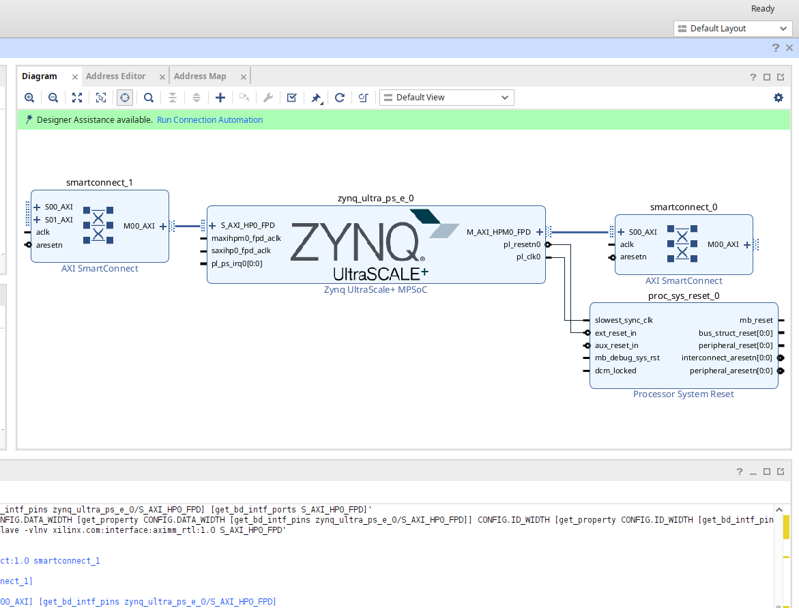
12. 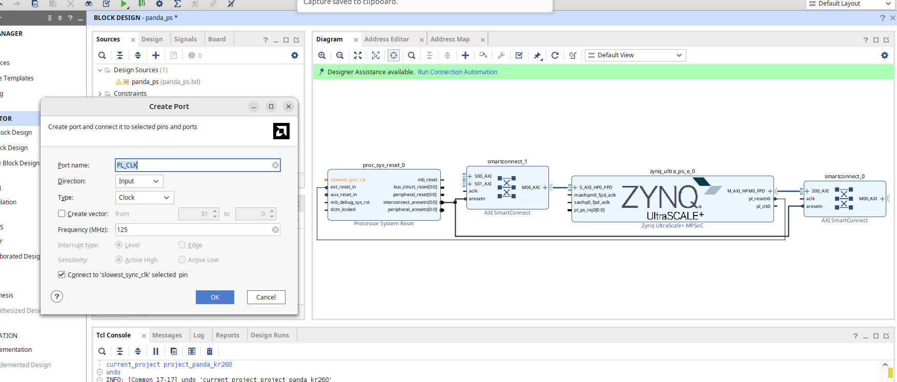
13. 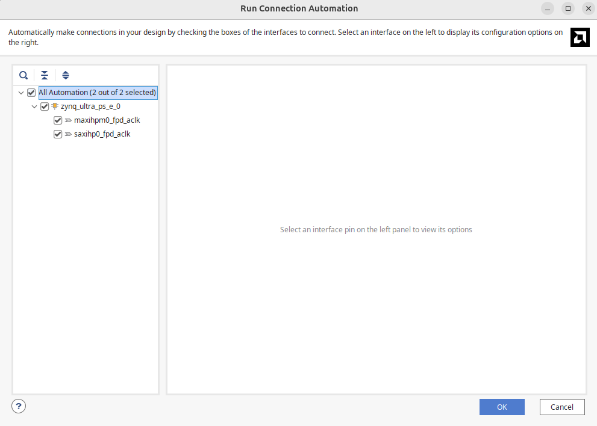
14. 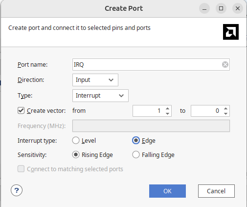
15. 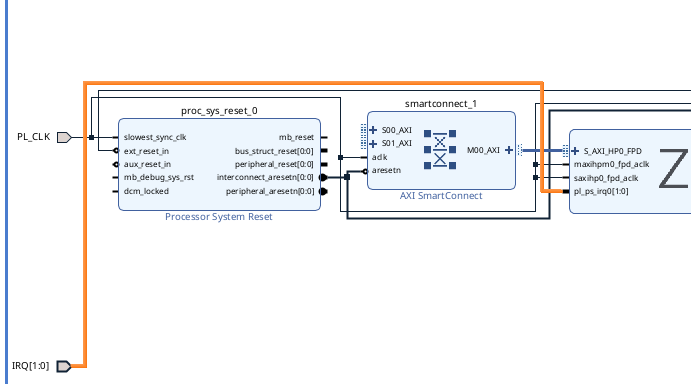
16. 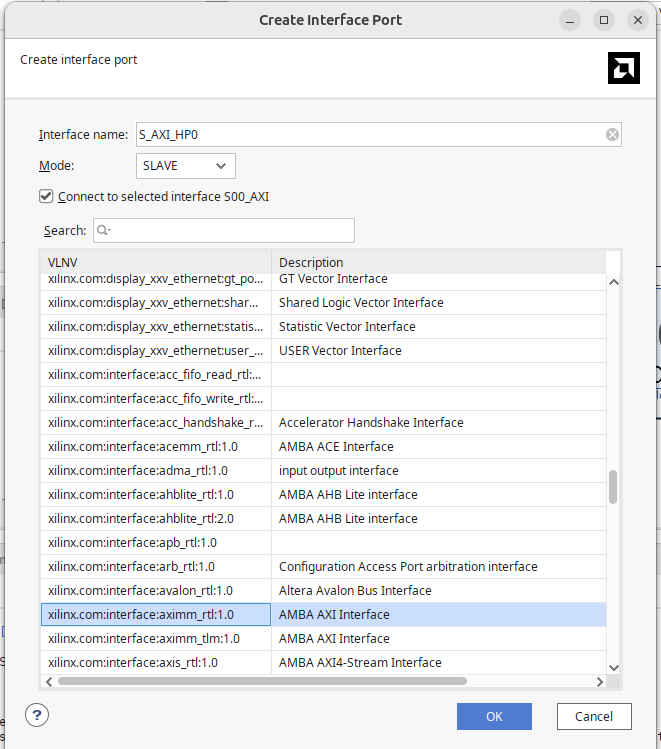
17. 
18. 
19. 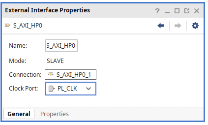
20. 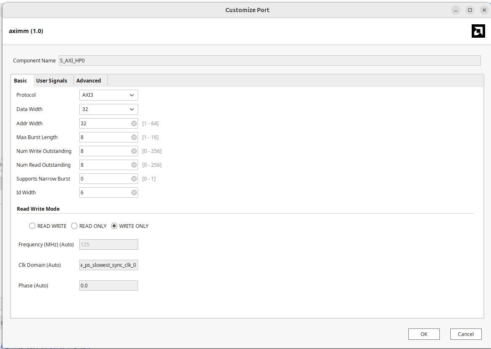
21. 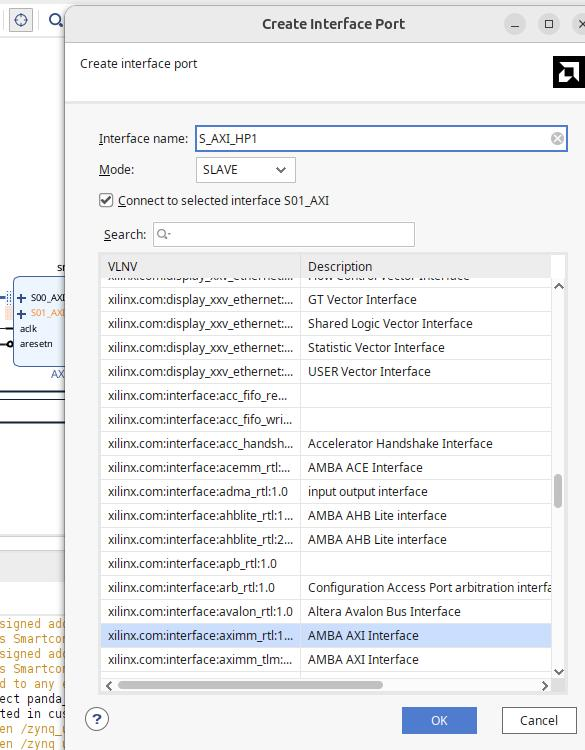
22. 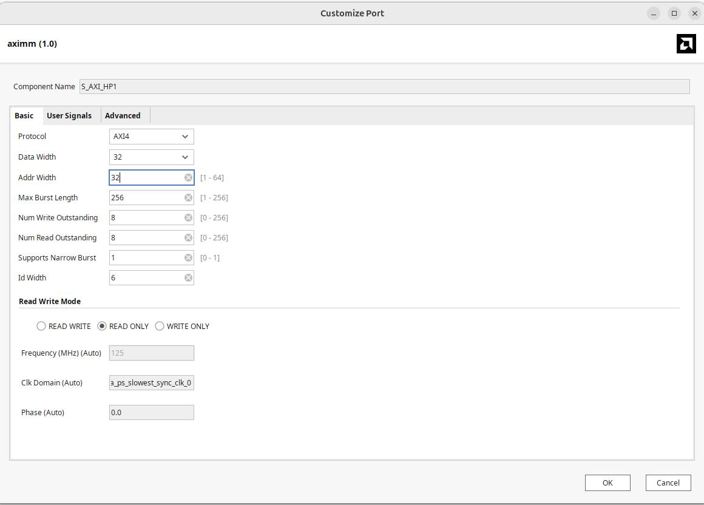
23. 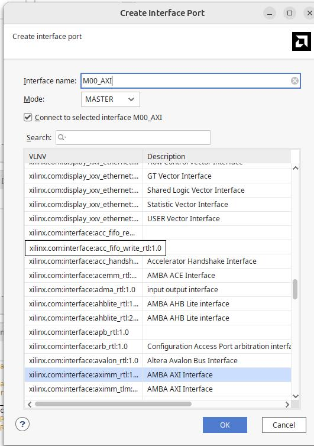
24. 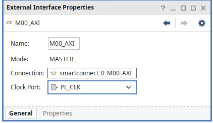
25. 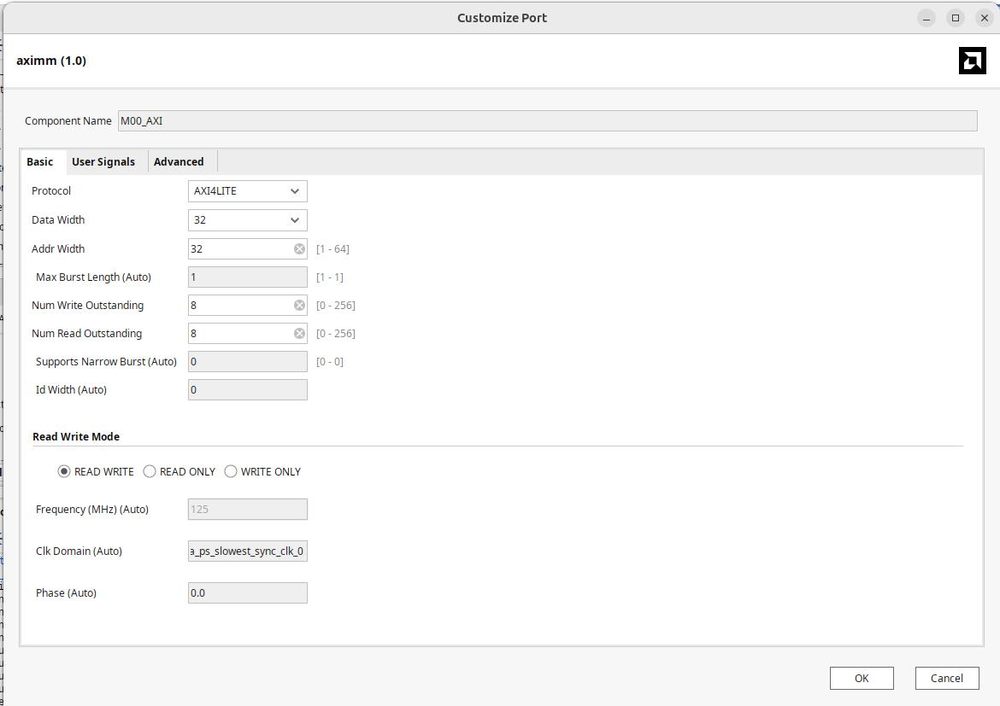
26. 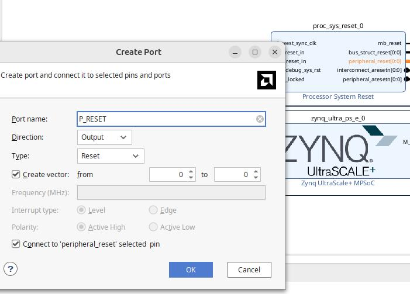
27. 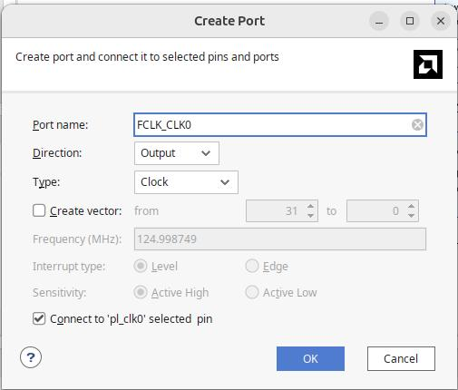
28. 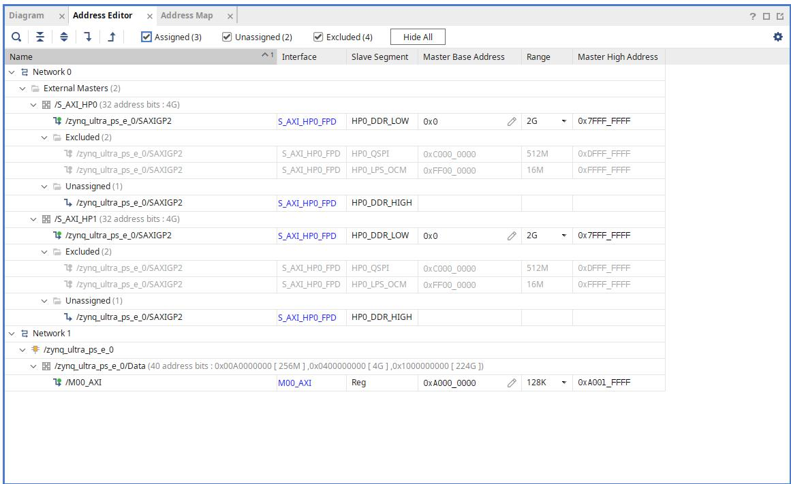
